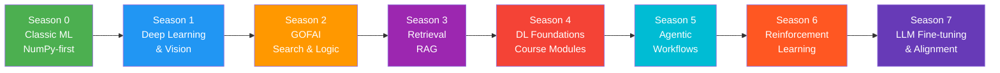
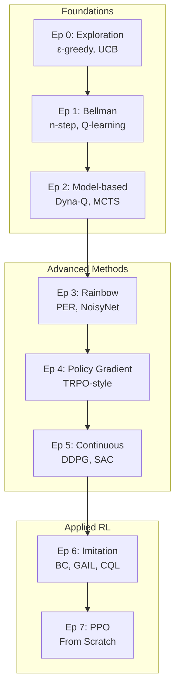
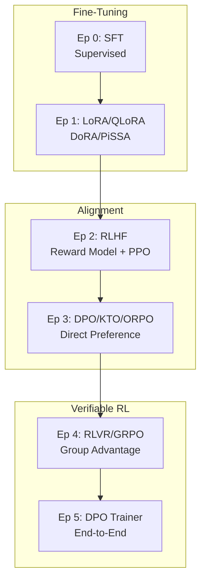

# Zero to AI Genesis 🧠🔬

[](https://github.com/krishnakumarbhat/Zero_to_AI_Genesis/actions/workflows/ci.yml)
[](https://python.org)

An educational **from-scratch AI learning repository** spanning 7+ seasons — from classic ML to LLM alignment. Each season builds on the previous, with explicit equations and lightweight implementations designed to teach internals, not just usage.

## 🏗️ Learning Roadmap



## 🔬 Season 6 — Reinforcement Learning Deep Dive



## 🔬 Season 7 — LLM Fine-Tuning & Alignment



## 🛠️ Tech Stack

| Component     | Technology                             |
| ------------- | -------------------------------------- |
| Core          | NumPy, Python 3.10+                    |
| Deep Learning | PyTorch (minimal)                      |
| Math          | LaTeX equations inline                 |
| Design        | From-scratch, no high-level frameworks |

## 📦 Setup

```bash
python3 -m venv .venv
source .venv/bin/activate
pip install -r requirements.txt
python3 src/data/make_dummy_data.py
```

## ▶️ Running Episodes

```bash
# Season 6 — RL
python3 src/season_6/episode_00_exploration_foundations.py
python3 src/season_6/episode_07_ppo_from_scratch.py

# Season 7 — LLM Alignment
python3 src/season_7/episode_00_sft.py
python3 src/season_7/episode_05_dpo_trainer_from_scratch.py
```

## 📁 Project Structure

```
Zero_to_AI_Genesis/
├── src/
│   ├── season_0/         # Classic ML (NumPy)
│   ├── season_1/         # Deep Learning & Vision
│   ├── season_2/         # GOFAI (Search/Logic)
│   ├── season_3/         # Retrieval / RAG
│   ├── season_4/         # DL Foundations
│   ├── season_5/         # Agentic Workflows
│   ├── season_6/         # Reinforcement Learning
│   ├── season_7/         # LLM Fine-Tuning & Alignment
│   └── data/             # Dummy data generation
├── requirements.txt
├── .github/workflows/    # CI/CD pipeline
├── .gitignore
└── README.md
```

## 📖 Key Equations

<details>
<summary><b>RL Core (Season 6)</b></summary>

**Expected Return:** $G_t = \sum_{k=0}^{\infty} \gamma^k R_{t+k+1}$

**Bellman Optimality:** $V^*(s) = \max_a \sum_{s',r}P(s',r|s,a)\left[r + \gamma V^*(s')\right]$

**PPO Clipped Surrogate:** $L^{CLIP}(\theta) = \hat{\mathbb{E}}_t\left[\min\left(r_t(\theta)\hat{A}_t, \text{clip}(r_t(\theta), 1-\epsilon, 1+\epsilon)\hat{A}_t\right)\right]$

</details>

<details>
<summary><b>LLM Alignment (Season 7)</b></summary>

**DPO:** $\mathcal{L}_{DPO}=-\mathbb{E}\left[\log\sigma\left(\beta\log\frac{\pi_\theta(y_w|x)}{\pi_{ref}(y_w|x)}-\beta\log\frac{\pi_\theta(y_l|x)}{\pi_{ref}(y_l|x)}\right)\right]$

**LoRA:** $W=W_0+\Delta W=W_0+BA,\quad r\ll d,k$

**GRPO:** $\hat{A}_i=\frac{r_i-\text{mean}(r_1,\dots,r_G)}{\text{std}(r_1,\dots,r_G)}$

</details>

## ⚠️ Scope

These are **teaching implementations** on dummy/synthetic data. For production-grade training, use distributed systems and robust ML frameworks.

## 📝 License

Apache 2.0 License
