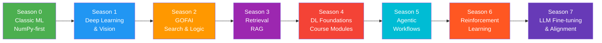
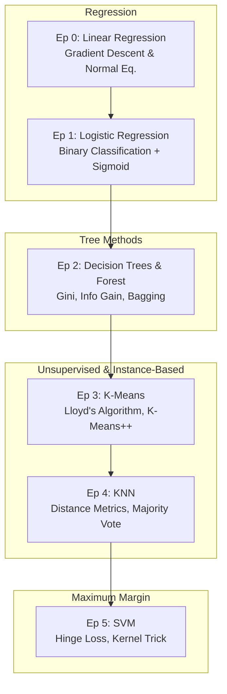
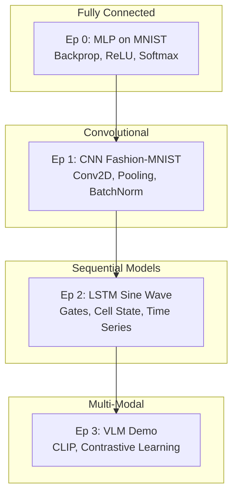
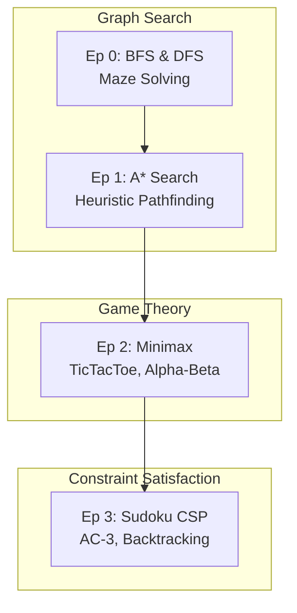
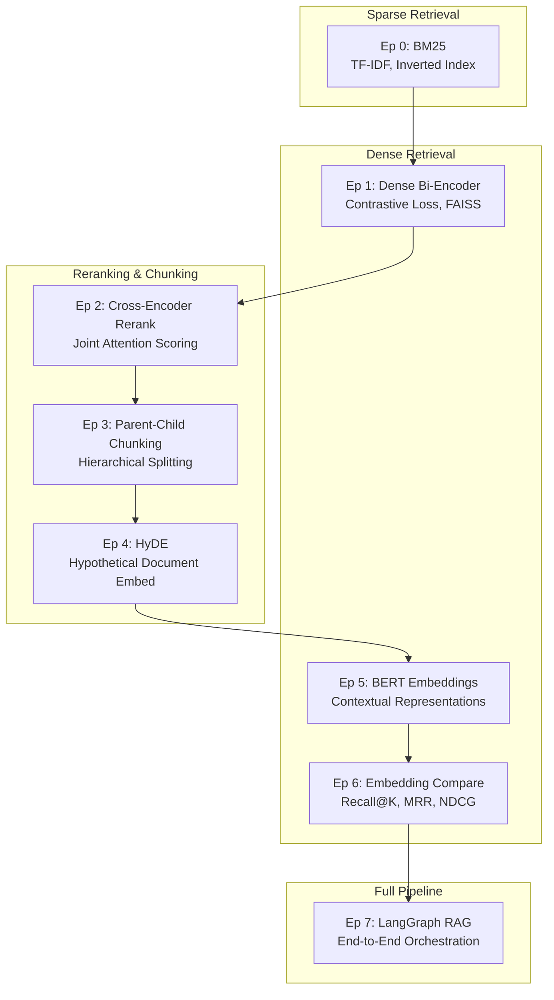
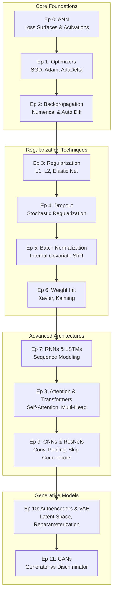
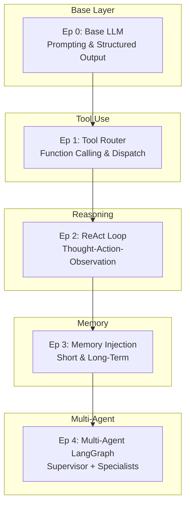
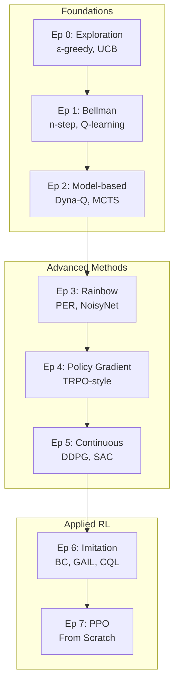
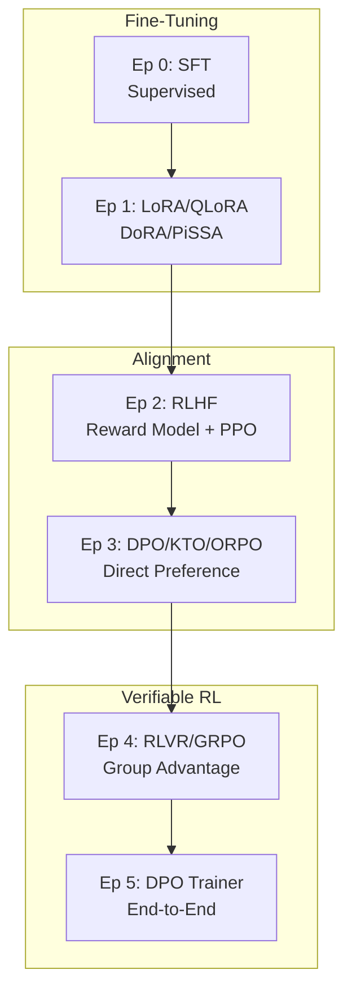

<div align="center">

# Zero to AI Genesis

### From NumPy to LLM Alignment — Build AI From Scratch

[](https://github.com/krishnakumarbhat/Zero_to_AI_Genesis/actions/workflows/ci.yml)
[](https://python.org)
[](https://numpy.org)
[](https://pytorch.org)
[](LICENSE)
[]()
[]()

---

An educational **from-scratch AI learning repository** spanning **7+ seasons** — from classic ML to LLM alignment.  
Each season builds on the previous, with **explicit equations** and **lightweight implementations** designed to teach **internals**, not just usage.

[Explore the Interactive Frontend](#-interactive-frontend) · [View Roadmap](#%EF%B8%8F-learning-roadmap) · [Quick Start](#-setup) · [Key Equations](#-key-equations)

</div>

---

## 🏗️ Learning Roadmap



---

## 🔬 Season 0 — Classic ML (NumPy-First)

> Build fundamental machine learning algorithms from scratch using only NumPy. Understand the math behind regression, classification, clustering, and SVMs.



| Episode | Title | Key Concepts | Key Equation |
|---------|-------|-------------|--------------|
| Ep 0 | Linear Regression | Gradient Descent, Normal Equation, MSE | $w^* = (X^T X)^{-1} X^T y$ |
| Ep 1 | Logistic Regression | Sigmoid, Binary Cross-Entropy, Decision Boundary | $\sigma(z) = \frac{1}{1 + e^{-z}}$ |
| Ep 2 | Decision Trees & Random Forest | Information Gain, Gini Impurity, Bagging | $H(S) = -\sum_c p_c \log_2 p_c$ |
| Ep 3 | K-Means Clustering | Lloyd's Algorithm, K-Means++, Elbow Method | $J = \sum_{i=1}^{n} \min_k \|x_i - \mu_k\|^2$ |
| Ep 4 | K-Nearest Neighbors | Euclidean/Manhattan Distance, Weighted KNN | $d(p,q) = \sqrt{\sum (p_i - q_i)^2}$ |
| Ep 5 | Support Vector Machines | Maximum Margin, Hinge Loss, Kernel Trick | $L = \frac{1}{2}\|w\|^2 + C\sum \max(0, 1-y_i(w \cdot x_i + b))$ |

---

## 🔬 Season 1 — Deep Learning & Vision

> Transition from classical ML to deep learning. Build neural networks from MLPs to CNNs, LSTMs, and vision-language models.



| Episode | Title | Key Concepts |
|---------|-------|-------------|
| Ep 0 | MLP on MNIST | Backpropagation, ReLU, Softmax, Mini-Batch SGD |
| Ep 1 | CNN on Fashion-MNIST | Convolution, Max Pooling, Feature Maps, Batch Normalization |
| Ep 2 | LSTM Sine Wave | Forget/Input/Output Gates, Cell State, Vanishing Gradient |
| Ep 3 | Vision-Language Model Demo | CLIP, Contrastive Learning, Image Encoder, Text Decoder |

---

## 🔬 Season 2 — GOFAI: Search & Logic

> Good Old-Fashioned AI: graph search, adversarial game trees, and constraint satisfaction problems.



| Episode | Title | Key Concepts | Key Equation |
|---------|-------|-------------|--------------|
| Ep 0 | BFS & DFS Maze Solver | Queue/Stack, Visited Set, Path Reconstruction | — |
| Ep 1 | A* Search | Admissible Heuristic, Priority Queue, Open/Closed Sets | $f(n) = g(n) + h(n)$ |
| Ep 2 | Minimax TicTacToe | Alpha-Beta Pruning, Game Tree, Optimal Play | $V(s) = \max_a \min_{a'} V(s')$ |
| Ep 3 | Sudoku CSP | Arc Consistency, Backtracking, MRV Heuristic | — |

---

## 🔬 Season 3 — Retrieval & RAG

> Master retrieval-augmented generation from sparse retrievers to dense embeddings, re-ranking, and full RAG pipeline orchestration.



| Episode | Title | Key Concepts |
|---------|-------|-------------|
| Ep 0 | BM25 | TF-IDF, Inverted Index, Document Length Normalization |
| Ep 1 | Dense Bi-Encoder | Contrastive Loss, FAISS Indexing, Hard Negatives |
| Ep 2 | Cross-Encoder Reranker | Joint Attention, NDCG Metric, Retrieve-then-Rerank |
| Ep 3 | Parent-Child Chunking | Recursive Splitting, Semantic Boundaries, Window Size |
| Ep 4 | HyDE | Hypothetical Generation, Query Expansion, Zero-Shot |
| Ep 5 | BERT Embeddings | WordPiece, [CLS] Pooling, Layer Selection |
| Ep 6 | Embedding Model Compare | Recall@K, MRR, NDCG, Hybrid Search |
| Ep 7 | LangGraph RAG Pipeline | State Machine, Query Routing, Hallucination Check |

---

## 🔬 Season 4 — DL Foundations (Course Modules)

> Deep dive into every building block of deep learning: ANNs, optimizers, backpropagation, regularization, normalization, RNNs, attention, CNNs, autoencoders, and GANs.



| Episode | Title | Key Concepts | Key Equation |
|---------|-------|-------------|--------------|
| Ep 0 | Artificial Neural Networks | Loss Surface, Activations, Classification | — |
| Ep 1 | Optimizers | SGD, Momentum, Adam, AdaDelta, LR Scheduling | $m_t = \beta_1 m_{t-1} + (1-\beta_1)g_t$ |
| Ep 2 | Backpropagation | Chain Rule, Numerical Diff, Autograd | — |
| Ep 3 | Regularization | L1 (Lasso), L2 (Ridge), Weight Decay | $L_{reg} = L + \lambda_1\|w\|_1 + \lambda_2\|w\|_2^2$ |
| Ep 4 | Dropout | Zero-Out Mask, Inverted Scaling | — |
| Ep 5 | Batch Normalization | Running Stats, Gamma/Beta Parameters | $\hat{x}_i = \frac{x_i - \mu_B}{\sqrt{\sigma_B^2 + \epsilon}}$ |
| Ep 6 | Weight Initialization | Xavier/Glorot, Kaiming/He, Fan-In/Out | — |
| Ep 7 | RNNs & LSTMs | SimpleRNN, LSTM, GRU, Bidirectional | — |
| Ep 8 | Attention & Transformers | Scaled Dot-Product, Multi-Head, Positional Encoding | $\text{Attn}(Q,K,V) = \text{softmax}(\frac{QK^T}{\sqrt{d_k}})V$ |
| Ep 9 | CNNs & ResNets | Cross-Correlation, Residual Connections, ConvLSTM | — |
| Ep 10 | Autoencoders & VAE | Latent Space, Denoising, Reparameterization Trick | $L = E_q[\log p(x|z)] - D_{KL}(q(z|x) \| p(z))$ |
| Ep 11 | GANs | Generator, Discriminator, Mode Collapse, DCGAN | $\min_G \max_D E[\log D(x)] + E[\log(1-D(G(z)))]$ |

---

## 🔬 Season 5 — Agentic Workflows

> Build autonomous AI agents: from basic LLM wrappers to tool-using agents, ReAct loops, memory systems, and multi-agent orchestration.



| Episode | Title | Key Concepts |
|---------|-------|-------------|
| Ep 0 | Base LLM Interface | System Prompt, Temperature, Token Sampling, JSON Mode |
| Ep 1 | Tool Router | Function Schema, Tool Selection, Parameter Extraction |
| Ep 2 | ReAct Loop | Thought-Action-Observation, Reasoning Trace, Termination |
| Ep 3 | Memory Injection | Buffer Memory, Summary Memory, Vector Store Memory |
| Ep 4 | Multi-Agent LangGraph | Supervisor Agent, Specialized Agents, State Graph |

---

## 🔬 Season 6 — Reinforcement Learning Deep Dive



| Episode | Title | Key Concepts | Key Equation |
|---------|-------|-------------|--------------|
| Ep 0 | Exploration Foundations | epsilon-greedy, UCB1, Thompson Sampling | $UCB_a = Q_a + c\sqrt{\frac{\ln t}{N_a}}$ |
| Ep 1 | Bellman & N-Step | Q-Learning, SARSA, TD Error | $Q(s,a) \leftarrow Q(s,a) + \alpha[r + \gamma \max_{a'} Q(s',a') - Q(s,a)]$ |
| Ep 2 | Model-Based | Dyna-Q, MCTS, World Model | — |
| Ep 3 | Rainbow Components | PER, NoisyNet, Dueling DQN, Distributional | — |
| Ep 4 | Policy Gradient | REINFORCE, Baseline, TRPO | $\nabla_\theta J = E_\pi[\nabla_\theta \log \pi_\theta(a|s) A^\pi(s,a)]$ |
| Ep 5 | Continuous Control | DDPG, SAC, Actor-Critic, Entropy Reg. | — |
| Ep 6 | Imitation & Offline RL | Behavioral Cloning, GAIL, CQL | — |
| Ep 7 | PPO From Scratch | Clipped Surrogate, GAE, Mini-Batch | $L^{CLIP}(\theta) = \hat{E}_t[\min(r_t\hat{A}_t, \text{clip}(r_t,1-\epsilon,1+\epsilon)\hat{A}_t)]$ |

---

## 🔬 Season 7 — LLM Fine-Tuning & Alignment



| Episode | Title | Key Concepts | Key Equation |
|---------|-------|-------------|--------------|
| Ep 0 | SFT | Instruction Format, Loss Masking, Causal LM | — |
| Ep 1 | LoRA / QLoRA / DoRA / PiSSA | Low-Rank Decomposition, 4-bit Quantization | $W = W_0 + BA, \quad r \ll d,k$ |
| Ep 2 | RLHF | Reward Model, Bradley-Terry, PPO + KL | — |
| Ep 3 | DPO / KTO / ORPO | Direct Preference, Implicit Reward, Reference Model | $L_{DPO} = -E[\log\sigma(\beta\log\frac{\pi_\theta(y_w|x)}{\pi_{ref}(y_w|x)} - \beta\log\frac{\pi_\theta(y_l|x)}{\pi_{ref}(y_l|x)})]$ |
| Ep 4 | RLVR / GRPO | Verifiable Rewards, Group Advantage | $\hat{A}_i = \frac{r_i - \text{mean}(r_1,...,r_G)}{\text{std}(r_1,...,r_G)}$ |
| Ep 5 | DPO Trainer E2E | Full Pipeline, Ref Caching, AlpacaEval | — |

---

## 🛠️ Tech Stack

| Component     | Technology                             |
| ------------- | -------------------------------------- |
| Core          | NumPy, Python 3.10+                    |
| Deep Learning | PyTorch (minimal)                      |
| Math          | LaTeX equations inline                 |
| Design        | From-scratch, no high-level frameworks |
| Frontend      | Next.js, React Flow, D3.js, Framer Motion |

---

## 🌐 Interactive Frontend

This repository includes a **fully interactive web application** built with Next.js that visualizes every season and episode with:

- **Algorithm Playground**: Select any Season (0-7) and Episode to explore
- **Animated Flow Graphs**: React Flow diagrams showing step-by-step algorithm architecture
- **Futuristic Dark Theme**: AI Lab aesthetic with season-specific neon accents
- **Responsive Design**: Full mobile and desktop support

### Running the Frontend

```bash
cd frontend
npm install
npm run dev
```

Visit `http://localhost:3000` to explore the interactive learning platform.

### Static Export for GitHub Pages

```bash
cd frontend
npm run build:pages
npm run preview
```

The production build is exported to `frontend/out/` and the repository now includes a GitHub Pages workflow that deploys that static output automatically.

---

## 📦 Setup

```bash
python3 -m venv .venv
source .venv/bin/activate
pip install -r requirements.txt
python3 src/data/make_dummy_data.py
```

## ▶️ Running Episodes

```bash
# Season 0 — Classic ML
python3 src/season_0/episode_00_linear_regression.py
python3 src/season_0/episode_05_svm.py

# Season 1 — Deep Learning
python3 src/season_1/episode_00_mlp_mnist.py
python3 src/season_1/episode_01_cnn_fashion_mnist.py

# Season 2 — GOFAI
python3 src/season_2/episode_00_bfs_dfs_maze.py
python3 src/season_2/episode_02_minimax_tictactoe.py

# Season 3 — RAG
python3 src/season_3/episode_00_bm25.py
python3 src/season_3/episode_09_langgraph_rag.py

# Season 5 — Agentic
python3 src/season_5/episode_00_base_llm.py
python3 src/season_5/episode_04_multi_agent_langgraph.py

# Season 6 — RL
python3 src/season_6/episode_00_exploration_foundations.py
python3 src/season_6/episode_07_ppo_from_scratch.py

# Season 7 — LLM Alignment
python3 src/season_7/episode_00_sft.py
python3 src/season_7/episode_05_dpo_trainer_from_scratch.py
```

---

## 📁 Project Structure

```
Zero_to_AI_Genesis/
├── frontend/                  # Interactive Next.js web application
│   ├── src/
│   │   ├── app/               # Next.js App Router pages
│   │   │   ├── page.tsx       # Landing page / Hero
│   │   │   └── season/[id]/   # Season detail pages
│   │   ├── components/        # React components
│   │   │   ├── Navbar.tsx
│   │   │   ├── Footer.tsx
│   │   │   ├── SeasonCard.tsx
│   │   │   ├── EpisodeDetail.tsx
│   │   │   ├── AlgorithmFlow.tsx
│   │   │   └── RoadmapTimeline.tsx
│   │   ├── data/              # Season & episode definitions
│   │   │   └── seasons.ts
│   │   └── lib/               # Utilities
│   │       └── utils.ts
│   ├── tailwind.config.ts
│   └── package.json
├── src/
│   ├── season_0/              # Classic ML (NumPy)
│   │   ├── episode_00_linear_regression.py
│   │   ├── episode_01_logistic_regression.py
│   │   ├── episode_02_trees_and_forest.py
│   │   ├── episode_03_kmeans.py
│   │   ├── episode_04_knn.py
│   │   ├── episode_05_svm.py
│   │   └── numpy_utils.py
│   ├── season_1/              # Deep Learning & Vision
│   │   ├── episode_00_mlp_mnist.py
│   │   ├── episode_01_cnn_fashion_mnist.py
│   │   ├── episode_02_lstm_sine_wave.py
│   │   └── episode_03_vlm_demo.py
│   ├── season_2/              # GOFAI (Search/Logic)
│   │   ├── episode_00_bfs_dfs_maze.py
│   │   ├── episode_01_astar.py
│   │   ├── episode_02_minimax_tictactoe.py
│   │   └── episode_03_sudoku_csp.py
│   ├── season_3/              # Retrieval / RAG
│   │   ├── episode_00_bm25.py
│   │   ├── episode_01_dense_biencoder.py
│   │   ├── episode_02_cross_encoder_rerank.py
│   │   ├── episode_03_parent_child_chunking.py
│   │   ├── episode_04_hyde.py
│   │   ├── episode_05_bert_embeddings.py
│   │   ├── episode_06_embedding_model_compare.py
│   │   └── episode_09_langgraph_rag.py
│   ├── season_4/              # DL Foundations (Course Modules)
│   │   ├── deep_learning-main/
│   │   │   ├── 1.ANN/
│   │   │   ├── 2.Optimizers/
│   │   │   ├── 3.Backpropagation/
│   │   │   ├── 4.Tensorflow_Keras/
│   │   │   ├── 5.Regularization/
│   │   │   ├── 6.Dropout/
│   │   │   ├── 7.BatchNormalization/
│   │   │   ├── 8.Weights_Initialization/
│   │   │   ├── 9.Highway_Networks/
│   │   │   ├── 10.RNN/
│   │   │   ├── 11.Attention/
│   │   │   ├── 12.CNN/
│   │   │   ├── 13.Autoencoder/
│   │   │   └── 14.GAN/
│   │   └── README.md
│   ├── season_5/              # Agentic Workflows
│   │   ├── episode_00_base_llm.py
│   │   ├── episode_01_tool_router.py
│   │   ├── episode_02_react_loop.py
│   │   ├── episode_03_memory_injection.py
│   │   └── episode_04_multi_agent_langgraph.py
│   ├── season_6/              # Reinforcement Learning
│   │   ├── episode_00_exploration_foundations.py
│   │   ├── episode_01_tabular_bellman_nstep.py
│   │   ├── episode_02_model_based_dynaq_mcts.py
│   │   ├── episode_03_rainbow_components.py
│   │   ├── episode_04_policy_gradient_trust_region.py
│   │   ├── episode_05_continuous_control_ddpg_sac.py
│   │   ├── episode_06_imitation_offline_rl.py
│   │   ├── episode_07_ppo_from_scratch.py
│   │   └── rl_utils.py
│   ├── season_7/              # LLM Fine-Tuning & Alignment
│   │   ├── episode_00_sft.py
│   │   ├── episode_01_peft_lora_family.py
│   │   ├── episode_02_rlhf_reward_model_ppo.py
│   │   ├── episode_03_dpo_kto_orpo.py
│   │   ├── episode_04_rlvr_grpo_rlpr.py
│   │   └── episode_05_dpo_trainer_from_scratch.py
│   └── data/                  # Dummy data generation
│       └── make_dummy_data.py
├── requirements.txt
├── .github/workflows/         # CI/CD pipeline
├── .gitignore
└── README.md
```

---

## 📖 Key Equations

<details>
<summary><b>RL Core (Season 6)</b></summary>

**Expected Return:** $G_t = \sum_{k=0}^{\infty} \gamma^k R_{t+k+1}$

**Bellman Optimality:** $V^*(s) = \max_a \sum_{s',r}P(s',r|s,a)\left[r + \gamma V^*(s')\right]$

**PPO Clipped Surrogate:** $L^{CLIP}(\theta) = \hat{\mathbb{E}}_t\left[\min\left(r_t(\theta)\hat{A}_t, \text{clip}(r_t(\theta), 1-\epsilon, 1+\epsilon)\hat{A}_t\right)\right]$

</details>

<details>
<summary><b>LLM Alignment (Season 7)</b></summary>

**DPO:** $\mathcal{L}_{DPO}=-\mathbb{E}\left[\log\sigma\left(\beta\log\frac{\pi_\theta(y_w|x)}{\pi_{ref}(y_w|x)}-\beta\log\frac{\pi_\theta(y_l|x)}{\pi_{ref}(y_l|x)}\right)\right]$

**LoRA:** $W=W_0+\Delta W=W_0+BA,\quad r\ll d,k$

**GRPO:** $\hat{A}_i=\frac{r_i-\text{mean}(r_1,\dots,r_G)}{\text{std}(r_1,\dots,r_G)}$

</details>

<details>
<summary><b>Classic ML (Season 0)</b></summary>

**Linear Regression (Normal Equation):** $w^* = (X^T X)^{-1} X^T y$

**Logistic Regression (Sigmoid):** $\sigma(z) = \frac{1}{1 + e^{-z}}$

**SVM Hinge Loss:** $L = \frac{1}{2}\|w\|^2 + C\sum_i \max(0, 1 - y_i(w \cdot x_i + b))$

**K-Means Objective:** $J = \sum_{i=1}^{n} \min_k \|x_i - \mu_k\|^2$

**Entropy (Decision Trees):** $H(S) = -\sum_c p_c \log_2 p_c$

</details>

<details>
<summary><b>Deep Learning Foundations (Season 4)</b></summary>

**Attention:** $\text{Attention}(Q,K,V) = \text{softmax}\left(\frac{QK^T}{\sqrt{d_k}}\right)V$

**Adam Optimizer:** $m_t = \beta_1 m_{t-1} + (1-\beta_1)g_t$

**Batch Normalization:** $\hat{x}_i = \frac{x_i - \mu_B}{\sqrt{\sigma_B^2 + \epsilon}}$

**VAE Loss:** $L = E_q[\log p(x|z)] - D_{KL}(q(z|x) \| p(z))$

**GAN Minimax:** $\min_G \max_D V(D,G) = E_x[\log D(x)] + E_z[\log(1-D(G(z)))]$

</details>

---

## ⚠️ Scope

These are **teaching implementations** on dummy/synthetic data. For production-grade training, use distributed systems and robust ML frameworks.

---

## 📝 License

Apache 2.0 License

---

<div align="center">
<sub>Built with care for the AI learning community</sub>
</div>
